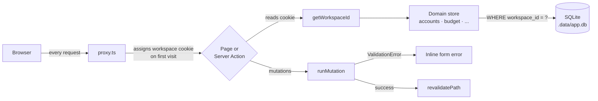
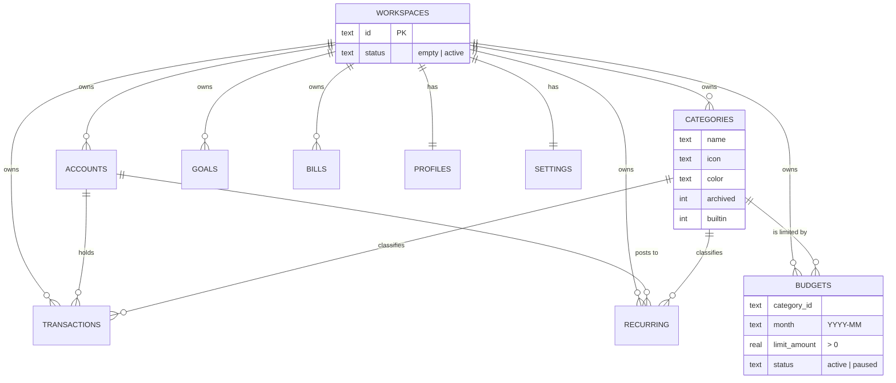

<div align="center">

# 💸 PennyComic

### A personal finance wallet with a comic-book soul

**Track accounts, transactions, budgets, goals and bills — in a bold, hand-drawn interface that makes money feel a little less boring.**


[Features](#-features) ·
[Quick start](#-quick-start) ·
[Architecture](#-architecture) ·
[Testing](#-testing) ·
[Make it yours](#-make-it-yours) ·
[Roadmap](#-roadmap)

</div>

---

## 📖 Table of contents

- [About the project](#-about-the-project)
- [Features](#-features)
- [Tech stack](#-tech-stack)
- [Quick start](#-quick-start)
- [Available scripts](#-available-scripts)
- [Project structure](#-project-structure)
- [Architecture](#-architecture)
- [Data model](#-data-model)
- [Design system](#-design-system)
- [Testing](#-testing)
- [Make it yours](#-make-it-yours)
- [Known limitations](#-known-limitations)
- [Roadmap](#-roadmap)
- [Troubleshooting](#-troubleshooting)
- [Contributing](#-contributing)
- [License](#-license)

---

## 🦸 About the project

PennyComic started as a simple question: *why does every finance app look like a spreadsheet?*

It is a **personal finance wallet** built for one person to manage their own money. It is not a bank, not a SaaS product, and not trying to be one. But it is built as if it were going to be — with the kind of care a professional codebase deserves:

- 🧱 **Business rules live in the database**, not just in the UI. A budget limit can't be zero, and a category can't have two budgets in the same month, because the table itself refuses.
- 🔒 **Changes are atomic.** Clearing your data empties six tables in a single transaction — all of it happens, or none of it does.
- 🧪 **Real risks are tested.** 237 tests cover the things that actually go wrong in finance apps: currency rounding drift, month boundaries in non-UTC timezones, renamed categories losing their history, and data surviving a server restart.
- 🎨 **And it still looks fun.** Thick borders, hard shadows, speech bubbles and a palette that pops.

> [!NOTE]
> This is a **personal, open, and evolving project**. It is designed to be forked, reshaped and improved. See [Make it yours](#-make-it-yours) for how.

---

## ✨ Features

### 🏠 Dashboard
- Total balance across every account, with a per-account breakdown
- This month's income and expenses at a glance
- A comic-style speech bubble that warns you which budget is closest to its limit
- Recent transactions, savings goal progress and upcoming bills in one view

### 🏦 Accounts
- Checking, savings, credit, debit, investment and cash accounts
- Negative starting balances for cards opened with existing debt
- **Safe deletion:** an account still used by transactions or recurring rules can't be deleted outright — you move its records to another account first

### 💳 Transactions
- Income and expenses with merchant, category, account, date and an optional note
- Search across merchants, categories and notes, and filter by account
- Balances update instantly and stay correct through edits and account moves

### 🔁 Recurring rules
- Weekly, monthly or yearly income and expenses (salary, subscriptions, rent)
- Due rules post themselves as transactions automatically
- Pause and resume without losing the schedule

### 📊 Budgets
- **One budget per category, per month.** September can have a different limit than October, and editing one never touches the other.
- **Copy last month** to set up a new month in one click
- **Paused** status to stop tracking a budget without deleting it
- **Unbudgeted spending** shows where money went that no budget covers
- Honest percentages: 130% is shown as 130% — only the progress bar is capped

### 🏷️ Categories
- Nine sensible defaults, plus your own with a custom name, icon and color
- **Rename without losing history.** Every record points at a category *id*, so renaming "Transport" to "Transportasi" keeps every past expense attached
- Archive categories you no longer use, or permanently delete one after moving its records elsewhere

### 🎯 Savings goals
- Set a target, track progress, add or withdraw funds
- A goal can never be driven below zero

### 🧾 Bills
- Due dates with automatic *upcoming* / *overdue* / *paid* status
- One-click pay and unpay

### 📈 Statistics
- Income vs. expenses over the last month, quarter or year

### 🌍 Multi-currency display
- View everything in **USD**, **IDR** or **EUR**
- Amounts are stored once in a single base currency and converted for display, so switching currency never changes your real numbers
- Saving an unchanged displayed value preserves the exact original amount, with no rounding drift

### ⚙️ Profile, preferences and your data
- Edit your display name and email
- Toggle bill reminders, budget warnings and reduced motion
- **Clear financial data** — see exactly how many records will be deleted, type `CLEAR` to confirm, and keep your profile and preferences
- **Load sample data** — explore the app with realistic example data, only offered on an empty workspace so it can never overwrite your own records

---

## 🛠️ Tech stack

| Layer | Technology | Why |
|---|---|---|
| Framework | [Next.js 16](https://nextjs.org) (App Router, Server Actions, Turbopack) | Server-rendered pages with mutations that run on the server, no separate API to maintain |
| UI | [React 19](https://react.dev) | Server Components by default, Client Components only where interaction needs them |
| Language | [TypeScript 5](https://www.typescriptlang.org) (strict) | Catches whole classes of bugs before they reach your data |
| Styling | [Tailwind CSS 4](https://tailwindcss.com) | Design tokens defined once in CSS with `@theme` |
| Database | [`node:sqlite`](https://nodejs.org/api/sqlite.html) | Built into Node — a real, persistent SQL database with **zero extra dependencies** |
| Animation | [Motion](https://motion.dev) | Small, deliberate flourishes |
| Testing | [Vitest 5](https://vitest.dev) | Fast, TypeScript-native test runner |
| Icons | [Material Symbols](https://fonts.google.com/icons) | A large, consistent icon set |

---

## 🚀 Quick start

### Prerequisites

- **Node.js 22 or newer** — required for the built-in `node:sqlite` module
- **npm** (bundled with Node)

Check your version:

```bash
node --version
```

### Installation

```bash
# 1. Clone the repository
git clone <your-repository-url> pennycomic
cd pennycomic

# 2. Install dependencies
npm install

# 3. Start the development server
npm run dev
```

Open **[http://localhost:3000](http://localhost:3000)** in your browser.

### First steps

A new workspace starts **completely empty** — on purpose. You have two ways in:

1. **Explore first:** go to **Profile → Your data → Load sample data** to fill the app with realistic example accounts, transactions, budgets, goals and bills.
2. **Start for real:** go to **Accounts → Link New Account** and add your first account.

> [!TIP]
> Your data is saved in `.data/app.db`, created automatically on first run. It survives reloads and server restarts, and it is ignored by git.

> [!NOTE]
> You may see `ExperimentalWarning: SQLite is an experimental feature` in the console. That is expected on Node 22 and does not affect anything.

---

## 📜 Available scripts

| Command | What it does |
|---|---|
| `npm run dev` | Starts the development server with hot reload at `localhost:3000` |
| `npm run build` | Creates an optimized production build |
| `npm run start` | Serves the production build |
| `npm run lint` | Runs ESLint across the project |
| `npm test` | Runs the full Vitest suite once |
| `npx tsc --noEmit` | Type-checks the whole project without emitting files |

**Before you commit**, the recommended check is:

```bash
npx tsc --noEmit && npm run lint && npm test
```

---

## 📁 Project structure

```
pennycomic/
├── .data/                     # SQLite database (auto-created, git-ignored)
├── public/                    # Static assets
├── src/
│   ├── proxy.ts               # Assigns each browser its workspace cookie
│   ├── app/                   # Next.js App Router
│   │   ├── (auth)/            #   Login and register screens
│   │   ├── (onboarding)/      #   Onboarding flow
│   │   ├── (dashboard)/       #   Every signed-in page
│   │   │   ├── page.tsx       #     Dashboard
│   │   │   ├── accounts/
│   │   │   ├── bills/
│   │   │   ├── budget/
│   │   │   ├── goals/
│   │   │   ├── profile/
│   │   │   ├── recurring/
│   │   │   ├── statistics/
│   │   │   └── transactions/
│   │   ├── globals.css        #   Design tokens and comic utilities
│   │   └── layout.tsx
│   ├── components/            # UI, grouped by feature
│   │   ├── ui/                #   Shared primitives: ComicButton, ComicCard,
│   │   │                      #   ComicDialog, ActionForm
│   │   ├── budget/
│   │   ├── transactions/
│   │   └── ...
│   └── lib/                   # Business logic, grouped by domain
│       ├── db/                #   Database connection, schema, migrations
│       ├── workspace/         #   Workspace identity, clear and sample data
│       ├── accounts/
│       ├── budget/
│       ├── categories/        #   Including the category-id migration
│       ├── transactions/
│       ├── ...
│       ├── action-result.ts   #   Shared mutation result and error handling
│       ├── form-validation.ts #   Server-side form field validation
│       └── dates.ts           #   Local-calendar date helpers
├── next.config.ts
├── vitest.config.ts
└── package.json
```

Every domain in `src/lib/` follows the same three-file shape:

| File | Responsibility |
|---|---|
| `types.ts` | TypeScript types and constants for the domain |
| `store.ts` | Reads and writes to the database, always scoped to a workspace |
| `actions.ts` | `"use server"` actions: validate form input, call the store, refresh pages |

Learn one domain and you have learned all of them.

---

## 🏗️ Architecture

### Request flow



### Key design decisions

#### 1. The workspace comes from a cookie — never from user input
On the first visit, `proxy.ts` gives the browser an httpOnly cookie holding a random workspace id. Every page and server action resolves the workspace from **that cookie only** — never from a form field, query string or request body a client could tamper with.

The id is resolved once per request and passed down **explicitly** to every store function. There is no hidden global, so you can see which workspace every query touches right at the call site.

> [!IMPORTANT]
> This is **per-browser isolation, not authentication.** It keeps each browser's data separate, but it is not a login. That is a deliberate fit for a personal app running locally. See [Known limitations](#-known-limitations) before exposing it to the internet.

#### 2. Business rules are enforced by the database
The rules that protect your data are written into the schema, so no future code path can quietly break them:

```sql
limit_amount REAL NOT NULL CHECK (limit_amount > 0),
status TEXT NOT NULL CHECK (status IN ('active', 'paused')),
CREATE UNIQUE INDEX ... ON budgets(workspace_id, category_id, month);
```

#### 3. Emptiness is recorded, never guessed
Each workspace stores an explicit `empty` or `active` status, kept accurate by SQL triggers. The app never decides "this looks empty, let me fill it with sample data". Sample data only ever appears because you asked for it.

#### 4. Mutations share one pattern
Every form goes through the same pipeline:

1. `ActionForm` submits once and locks against double clicks
2. The server action validates every field with `form-validation.ts`
3. A problem throws a `ValidationError` tied to a field name
4. `runMutation` turns it into `{ ok: false, errors }`
5. The form shows the message right next to the input, and your draft stays intact

#### 5. Money is stored once, displayed many ways
All amounts are stored in a single base currency (USD). The display currency only changes how numbers are *shown*. Each form declares which currency it was typed in, and the server converts exactly once.

---

## 🗄️ Data model



Every per-workspace table uses a **composite primary key** `(workspace_id, id)`. Ids such as `a1` or `t4` are counted per workspace, so two workspaces can both have an `a1` without ever colliding.

### Migrations

Schema changes run automatically the first time the database opens, and they are written to be safe on existing data:

| Migration | What it protects |
|---|---|
| Composite primary keys | Rebuilds tables keyed on `id` alone, copying every row across |
| Category ids | Maps old category *names* to ids, creates a category for any name that no longer exists instead of dropping the row, and **refuses to finish** while any transaction would be left without a category |
| Legacy budgets | Keeps a non-empty old budget table aside under a `_legacy` name instead of deleting it |

---

## 🎨 Design system

PennyComic's look comes from a small set of rules applied consistently.

### Principles
- **Thick borders.** Every card, button and input has a heavy 2px outline.
- **Hard shadows.** Offset, un-blurred shadows instead of soft glows, like ink on paper.
- **Bold, flat color.** Saturated fills with no gradients on core surfaces.
- **Speech bubbles.** Insights and warnings talk to you.

### Core palette

| Token | Value | Used for |
|---|---|---|
| `--color-primary` | `#005ab6` | Primary actions and links |
| `--color-secondary` | `#006d37` | Income and positive states |
| `--color-danger` | `#EB5757` | Expenses, over-budget and destructive actions |
| `--color-warning` | `#F2C94C` | Near-limit budget warnings |
| `--color-ink` | `#1F2933` | Body text |
| `--color-border-heavy` | `#111827` | Borders and hard shadows |
| `--color-surface` | `#fafaf5` | Paper-like background |

Every token lives in the `@theme` block of [`src/app/globals.css`](src/app/globals.css). **Change a value there and it updates everywhere.**

### Shared components

| Component | Purpose |
|---|---|
| `ComicCard` | The bordered, shadowed panel used across every page |
| `ComicButton` | `primary`, `secondary`, `outline` and `danger` variants |
| `ComicDialog` | A native `<dialog>` with focus trapping, Escape to close and a backdrop built in |
| `ActionForm` | Form wrapper with a saving state, a double-submit lock and inline field errors |

### Accessibility
- All modals use the native `<dialog>` element, so keyboard and screen reader support comes from the browser
- Form fields have associated labels, and errors are announced with `role="alert"`
- A **Reduce motion** preference is available in Profile settings

---

## 🧪 Testing

```bash
npm test
```

**237 tests across 18 files**, all running against a private in-memory database so they never touch your real data.

### What is covered

The suite is organized around the risks that actually hurt a finance app:

| Risk | How it is verified |
|---|---|
| **Sample data reappears after clearing** | Clears a workspace, then closes and reopens a **real database file** to simulate a server restart |
| **Recurring rules refill a cleared workspace** | Clears while rules are due, and again right after they post |
| **One workspace touches another's data** | Runs two workspaces side by side and checks clear, sample data and custom categories stay separate |
| **Renaming a category breaks history** | Renames a category and confirms balances, spending and budget usage are unchanged |
| **Deleting a budget deletes transactions** | Deletes a budget and confirms every transaction and balance is intact |
| **Editing this month changes last month** | Edits September and confirms August is untouched |
| **Currency conversion drifts** | Round-trips amounts through USD, IDR and EUR, including rounding edge cases |
| **Double clicks save twice** | Fires identical submits in parallel and confirms the database accepts only one |

### Worth knowing

- Tests run pinned to the **Asia/Jakarta** timezone (UTC+7), which exposes date bugs that stay hidden in UTC — like a transaction entered at 00:30 on the 1st landing in the wrong month.
- Each test resets its workspace with `resetWorkspaceForTest()` from `src/lib/workspace/testing.ts`.

---

## 🧩 Make it yours

> [!TIP]
> **PennyComic is meant to be customized, extended and improved.** It is a personal project with a clean foundation, and every part of it can be adapted to fit your needs better as it grows. Fork it, reshape it, break it and rebuild it. The structure is intentionally predictable, so changes stay easy.

Here are some common ways to adapt it.

### 🎨 Change the look
Edit the `@theme` block in `src/app/globals.css`. Colors, fonts and spacing are all tokens, so one change updates the whole app.

### 💱 Add a currency
Adding a currency touches two files. TypeScript will point out anything you miss.

**1.** In `src/lib/currency/types.ts`, extend the type and add the rate:

```ts
export type CurrencyCode = "USD" | "IDR" | "EUR" | "SGD";

// inside CURRENCIES
SGD: { code: "SGD", symbol: "S$", locale: "en-SG", rate: 1.35, fractionDigits: 2 },
```

**2.** In `src/components/currency/CurrencySwitcher.tsx`, give it a display name and a color:

```ts
const currencyNames: Record<CurrencyCode, string> = {
  USD: "US Dollar", IDR: "Indonesian Rupiah", EUR: "Euro", SGD: "Singapore Dollar",
};

const currencyColors: Record<CurrencyCode, string> = {
  USD: "bg-pop-blue", IDR: "bg-secondary-container", EUR: "bg-pop-purple", SGD: "bg-warning",
};
```

The switcher and server-side validation both read from `CURRENCIES`, so nothing else needs to change. Rates are fixed values relative to USD, so you can keep them manual or replace them with a live exchange rate source.

### 🏷️ Change the default categories
Edit `CATEGORIES` in `src/lib/transactions/types.ts`. New workspaces are seeded from this list. Available icons and colors for custom categories live in `src/lib/categories/types.ts`.

### 🧪 Change the sample data
Everything *Load sample data* inserts is defined in one place: `src/lib/workspace/sampleData.ts`.

### ➕ Add a new feature domain
Follow the pattern every existing domain already uses:

1. **Schema** — add a table to `src/lib/db/client.ts` with a `workspace_id` column and `PRIMARY KEY (workspace_id, id)`
2. **Types** — create `src/lib/<domain>/types.ts`
3. **Store** — create `store.ts` where every function takes `workspaceId` first
4. **Actions** — create `actions.ts` with `"use server"`, resolving the workspace via `getWorkspaceId()` and wrapping work in `runMutation`
5. **UI** — add a page under `src/app/(dashboard)/` and components built on `ActionForm` and `ComicDialog`
6. **Tests** — add a `*.test.ts` next to the store, using `resetWorkspaceForTest()`

### 🗄️ Swap the database
All database access goes through `getDb()` in `src/lib/db/client.ts` and the domain `store.ts` files. The UI and server actions never write SQL directly. Moving to PostgreSQL or another database means changing the stores, not the whole app.

---

## ⚠️ Known limitations

Being honest about what is not done yet is part of building something well. These are the most important gaps, roughly in order of priority:

| # | Limitation | Why it matters | Suggested fix |
|---|---|---|---|
| 1 | **Amounts are stored as floating-point numbers** | Small rounding errors can slowly accumulate over years of records | Store amounts as integers in the smallest currency unit |
| 2 | **No backup or export** | All data lives in a single `.data/app.db` file on one machine | Add CSV export and a simple backup routine |
| 3 | **Recurring dates can drift** | A rule due on the 31st can skip ahead a few days in shorter months | Clamp to the last day of the month when advancing |
| 4 | **No real authentication** | The workspace cookie separates browsers but is not a login | Required **before** hosting this on the internet |
| 5 | **Decorative screens** | Login, register and onboarding are visual only | Connect them once authentication exists |
| 6 | **Single-process database** | SQLite suits one server process, not a cluster | Fine for personal use; move to a networked database only if you scale out |

> [!WARNING]
> **Running locally or on your home network is the intended setup.** Do not expose PennyComic to the public internet until limitation #4 is addressed.

---

## 🗺️ Roadmap

Ideas for where PennyComic could go next. Every item is open for anyone who wants to pick it up.

**Data integrity**
- [ ] Store money as integer minor units
- [ ] Fix end-of-month recurring date handling
- [ ] CSV export and import
- [ ] One-click database backup and restore

**Features**
- [ ] Transfers between accounts
- [ ] Split transactions across categories
- [ ] Receipt attachments
- [ ] Charts inside the budget page
- [ ] Live exchange rates

**Platform**
- [ ] Real authentication
- [ ] Installable PWA for mobile
- [ ] Dark mode that keeps the comic style
- [ ] Localization, starting with Indonesian

---

## 🔧 Troubleshooting

<details>
<summary><b><code>npm run dev</code> hangs on "Compiling /"</b></summary>

<br>

This happens when Tailwind's automatic source detection scans outside the project folder, for example when the project lives inside a home directory that is itself a git repository.

It is already fixed: `src/app/globals.css` pins scanning to `src/` with:

```css
@import "tailwindcss" source("../");
```

If you move files outside `src/`, add them with an extra `@source` line.

</details>

<details>
<summary><b>"Cannot find native binding" or <code>npm install</code> fails</b></summary>

<br>

Packages such as `lightningcss`, `rolldown` and `@next/swc` ship a separate native binary for each operating system. If `node_modules` was installed on a different OS than the one you are running now, those binaries won't load.

Reinstall on the current machine:

```bash
npm install
```

If you work on the same folder from both **Windows and Linux**, run `npm install` again every time you switch. Only one platform's binaries can be installed at a time.

</details>

<details>
<summary><b>I want to start over with a clean database</b></summary>

<br>

To clear only financial data while keeping your profile and preferences, use **Profile → Your data → Clear financial data** inside the app.

To reset everything, stop the server and delete the database file:

```bash
rm -rf .data
```

It will be recreated, empty, on the next start.

</details>

<details>
<summary><b>The page shows a 500 error after deleting <code>.next</code></b></summary>

<br>

Deleting `.next` while `npm run dev` is running removes files the dev server depends on. Stop the server, then start it again.

</details>

---

## 🤝 Contributing

Suggestions, fixes and new ideas are all welcome.

1. **Fork** the repository and create a branch:
   ```bash
   git checkout -b feature/your-idea
   ```
2. **Follow the existing patterns** described in [Make it yours](#-make-it-yours)
3. **Add tests** for any behavior you change, especially anything that touches money or dates
4. **Run the full check** before opening a pull request:
   ```bash
   npx tsc --noEmit && npm run lint && npm test
   ```
5. **Open a pull request** that explains *why* the change is needed, not only what it does

### Guidelines
- Validate every input on the server, even when the form already checks it
- Keep store functions scoped to a `workspaceId`
- Prefer a database constraint over a check that only lives in code
- Stage files by path rather than with `git add -A`, and review what you commit

---

## 📄 License

This project does not have a license yet, which means all rights are reserved by default.

If you plan to share it publicly or accept contributions, consider adding one. The [MIT License](https://choosealicense.com/licenses/mit/) is a common, permissive choice for personal projects.

---

<div align="center">

**Built with care, one penny at a time.** 💸

*PennyComic is a living project — adapt it, improve it, and make it better for whatever comes next.*

</div>
